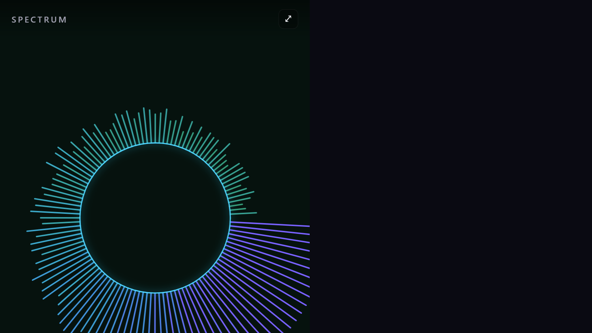

# Spectrum Visualizer

An installable Progressive Web App (PWA) that visualizes the audio spectrum of music and
sound playing on your machine. It captures audio from a shared browser tab or your screen,
runs it through the Web Audio API, and renders it with several switchable visualization
styles and color themes.



## Features

- **Live audio spectrum** via the Web Audio API `AnalyserNode` (FFT).
- **Two audio sources**: share a browser tab / your screen, or use your **microphone**.
- **Eight visualization styles**, switchable at runtime:
  - **Bars** — classic frequency bars with falling peak markers
  - **3D Bars** — pseudo-3D boxed bars (lit top/side faces) that pulse on the beat
  - **Wave** — stabilized oscilloscope (zero-crossing trigger) with loudness-reactive glow
  - **Radial** — circular spectrum with a bass-driven pulsing ring
  - **Particles** — audio-reactive particle field that bursts on each beat
  - **Mirror Bars** — symmetric frequency bars growing from a center line
  - **Spectrogram** — scrolling heatmap of frequency intensity over time
  - **Blob** — smooth, organic shape that morphs with the frequency spectrum and pulses to the bass
- **Beat & BPM detection** — bass-onset beat tracking drives reactive pulses/bursts across
  visualizers, with a live BPM readout in the top bar.
- **Twelve color themes**: Neon, Sunset, Aurora, Mono, Fire, Ice, Vaporwave, Forest, Candy, Ocean, Gold, Rainbow.
- **Audio controls**:
  - **Gain** slider (up to 10×) to scale sensitivity.
  - **Auto-gain** toggle that normalizes loudness automatically (great for quiet tracks).
  - **Smoothing** slider for snappier or more fluid motion.
  - **Log frequency** toggle to spread bass detail across the display (matches how we hear pitch).
- **Trails** slider controls motion-trail persistence on the Wave, Particles, and Blob styles.
- **Auto-hiding UI** for a clean "ambient mode" — controls fade out after a few seconds of inactivity.
- **Screen Wake Lock** keeps the display awake while visualizing (where supported).
- **Keyboard shortcuts** (see below).
- **Installable PWA** with offline app-shell caching.
- **Remembers** all your settings (style, theme, gain, smoothing, trails, toggles) via `localStorage`.
- **Fullscreen** toggle and hi-DPI / responsive canvas.

## Keyboard shortcuts

| Key | Action |
| --- | --- |
| `←` / `→` | Previous / next visualization style |
| `↑` / `↓` | Previous / next color theme |
| `1`–`8` | Jump directly to a style |
| `A` | Toggle auto-gain |
| `L` | Toggle logarithmic frequency scaling |
| `F` | Toggle fullscreen |
| `Space` | Start / stop |

## How audio capture works

The app offers two sources on the start screen:

- **Share audio** uses `navigator.mediaDevices.getDisplayMedia({ video: true, audio: true })` —
  your browser prompts you to share a **tab** or your **screen**. You must enable the
  **"Share tab audio"** (or **"Share system audio"**) checkbox in that dialog. The app then
  ignores the video and visualizes only the audio. (Browsers cannot tap system-wide audio
  output directly, which is why screen/tab sharing is used.)
- **Use microphone** uses `getUserMedia` to react to live sound in the room (or any input
  device), with no screen sharing required.

> **Browser support:** Best in Chromium-based browsers (Chrome, Edge). Tab/system audio
> capture via `getDisplayMedia` is limited or unavailable in Firefox and Safari; microphone
> input works broadly.
>
> **Secure context:** audio capture and PWA features require HTTPS or `localhost`.

## Getting started

```bash
npm install
npm run dev      # start the dev server (http://localhost:5173)
```

Then open the URL, choose **Share audio** (pick a tab/screen and enable audio sharing) or
**Use microphone**.

### Build & preview

```bash
npm run build    # production build into dist/
npm run preview  # serve the production build locally
```

The production build is a fully static bundle (in `dist/`) that can be hosted on any static
host with HTTPS. The service worker and manifest enable installation and offline use.

## Project structure

```
src/
  main.js               # bootstrap, canvas sizing, render loop, start/stop, wake lock
  audio/
    capture.js          # getDisplayMedia / getUserMedia -> AudioContext -> AnalyserNode
    analysis.js         # band energies + beat/BPM detection
  visualizers/
    index.js            # registry
    bars.js bars3d.js wave.js radial.js particles.js
    mirror.js spectrogram.js blob.js
  themes.js             # color palettes
  ui/controls.js        # control bar + persistence
  styles.css
public/icons/           # PWA icons + favicon
```

### Adding a visualizer

Create a module in `src/visualizers/` that returns an object with `id`, `name`, an optional
`reset()`, and a `draw(ctx, { width, height, dpr }, { freq, time, gain, fade, audio }, theme, dt)`
method, then register it in `src/visualizers/index.js`. The `audio` object provides
`{ bass, mid, treble, level, beat, beatEnergy, bpm }` for beat-reactive effects.

### Adding a theme

Add an entry to the `themes` array in `src/themes.js`. Each theme exposes
`sample(t, alpha)` and `gradient(ctx, x0, y0, x1, y1)` helpers used by the visualizers.
